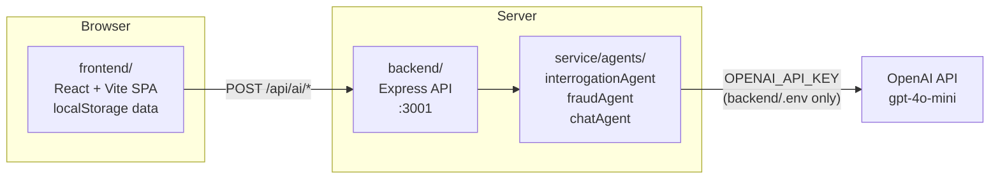

# تحصين Tahseen — AI-Powered Financial Protection

**Live demo:** https://tahssen.vercel.app

Tahseen is a demo banking app that intercepts outgoing transfers and interrogates them with adaptive AI questions before they go through. Every transfer triggers a conversation: the AI asks about the purpose, the relationship to the recipient, and any red flags — then scores the fraud risk, recommends whether to allow or block, and automatically quarantines beneficiaries tied to confirmed scams. The app is Arabic-first with full English support, built as a React + Express monorepo, and stores all account data locally in the browser so nothing touches a real bank.

---

## Features

- **Adaptive transfer interrogation** — up to four AI-driven questions per transfer, each one informed by previous answers; the conversation stops early when the picture is clear
- **Instant-signal short-circuits** — known-person keywords (family, colleagues, neighbors) skip AI analysis; crypto/investment phrases and social-media strangers trigger an immediate block without burning tokens
- **AI fraud scoring** — ambiguous transfers reach a backend fraud agent that returns a 0-100 risk score, risk level, red flags, and predictions via GPT-4o-mini
- **Beneficiary management with auto-block** — saved beneficiaries can be activated, blocked manually, or auto-blocked after a fraud verdict; blocked beneficiaries are barred from future transfers
- **Financial advisor chat** — a chat agent grounded in the user's live account data (balance, monthly spend, fixed expenses, transaction history) answers budgeting questions and surfaces insights
- **Analytics and health score** — spending vs. budget ring, fixed-expense tracker by category, AI-generated insights, monthly transaction stats
- **RTL Arabic + English** — CSS logical properties throughout, Tajawal typeface, one-tap language toggle

---

## Architecture



The API key never leaves the server. The frontend has no access to it.

### Repo structure

```
tahseen/
├── package.json          # npm workspaces root; scripts: dev / build / start
├── frontend/             # React 19 + Vite 6 SPA — all UI, routing, localStorage state
│   └── src/
│       ├── pages/        # SplashPage, AuthPage, HomePage, TransferPage, ChatPage,
│       │                 #   AnalyticsPage, BeneficiariesPage, SettingsPage
│       ├── agents/       # client-side transferAgent (instant signals), thin wrappers
│       │                 #   for fraudAgent and chatAgent that call the backend API
│       ├── store/        # db.js (localStorage), AccountContext (global state + actions)
│       └── api/          # client.js — typed fetch wrappers for /api/ai/* endpoints
├── backend/              # Express API server — the only layer that touches OpenAI
│   ├── server.js         # cors, json, /api mount, static frontend dist + SPA fallback
│   ├── routes/ai.js      # POST /api/ai/interrogate, /analyze, /chat; GET /api/health
│   └── .env.example      # OPENAI_API_KEY, OPENAI_MODEL, PORT
└── service/              # Pure ESM AI-agent library (no Express); used only by backend
    └── agents/
        ├── llm.js               # getClient(), AiNotConfiguredError, MODEL env var
        ├── interrogationAgent.js # adaptive conversation manager, instant-signal lists
        ├── fraudAgent.js        # short-circuits + GPT risk rubric, 0-100 score
        └── chatAgent.js         # financial advisor, account-grounded system prompt
```

---

## Getting started

### Prerequisites

- Node >= 20
- An OpenAI API key (optional — the app degrades gracefully without one; see note below)

### Install

```bash
git clone https://github.com/Abdulazizalhussein/Tahssen.git
cd Tahssen
npm install
```

### Configure

```bash
cp backend/.env.example backend/.env
# Open backend/.env and set your key:
# OPENAI_API_KEY=sk-...
```

### Run in development

```bash
npm run dev
# frontend → http://localhost:5173
# backend  → http://localhost:3001
```

Vite proxies all `/api` requests to the backend so there is no CORS friction in development.

### Production build

```bash
npm run build   # bundles frontend into frontend/dist/
npm start       # serves frontend/dist/ + API from a single Express server on :3001
```

### Without an API key

The app degrades gracefully. Instant-signal rules (known-person detection, crypto-phrase blocking, social-stranger detection) still run on the client. Backend AI endpoints return a 503 with `AI_NOT_CONFIGURED`, and the frontend falls back to a cautious mid-range risk score so the user is never silently waved through.

---

## Disclaimer

This is a demo project. Bank account data is fake and stored only in your browser's localStorage — no real accounts, no real money, no real transactions. Authentication is demo-grade (SHA-256 of password + a static salt). Do not use this code as the basis for a production banking or payments product.
