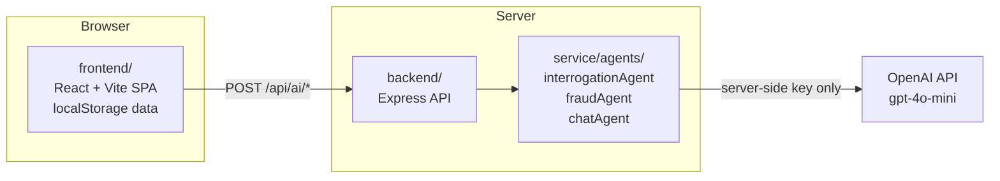

# تحصين Tahseen — AI-Powered Financial Protection

**🔗 Live app:** https://tahssen.vercel.app

Tahseen is a demo banking app that intercepts outgoing transfers and interrogates them with adaptive AI questions before they go through. Every transfer triggers a conversation: the AI asks about the purpose, the relationship to the recipient, and any red flags — then scores the fraud risk, recommends whether to allow or block, and automatically quarantines beneficiaries tied to confirmed scams. The app is Arabic-first with full English support, built as a React + Express monorepo, and stores all account data locally in the browser so nothing touches a real bank.

---

## Features

- **Adaptive transfer interrogation** — up to four AI-driven questions per transfer, each one informed by previous answers; the conversation stops early when the picture is clear
- **Instant-signal short-circuits** — known-person keywords (family, colleagues, neighbors) skip AI analysis; crypto/investment phrases and social-media strangers trigger an immediate block without burning tokens
- **AI fraud scoring** — ambiguous transfers reach a backend fraud agent that returns a 0-100 risk score, risk level, red flags, and predictions via GPT-4o-mini
- **Beneficiary management with auto-block** — saved beneficiaries can be activated, blocked manually, or auto-blocked after a fraud verdict; blocked beneficiaries are barred from future transfers
- **Financial advisor chat** — a chat agent grounded in the user's live account data (balance, monthly spend, fixed expenses, transaction history) answers budgeting questions and surfaces insights
- **Analytics and health score** — spending vs. budget ring, fixed-expense tracker by category, AI-generated insights, monthly transaction stats
- **RTL Arabic + English** — CSS logical properties throughout, Tajawal typeface, one-tap language toggle

---

## How it works

A transfer moves through a five-stage pipeline:

1. **Beneficiary check** — blocked beneficiaries are stopped before anything else; previously-trusted ones are fast-tracked
2. **Intent review** — the interrogation agent opens a short conversation about the transfer's purpose
3. **Instant signals** — deterministic rules run first on every answer: known-person phrases approve instantly, crypto/investment promises and social-media strangers block instantly
4. **AI risk analysis** — anything ambiguous goes to the fraud agent, which weighs the beneficiary type, amount, stated reasons, and transfer history against a scoring rubric
5. **Verdict** — safe transfers confirm in one tap; risky ones show the full analysis (score, red flags, predictions) and either warn or block, auto-quarantining the beneficiary on a fraud verdict

---

## Architecture



The OpenAI key lives only on the server. The frontend never sees it.

### Repo structure

```
├── frontend/             # React 19 + Vite SPA — all UI, routing, localStorage state
│   └── src/
│       ├── pages/        # Splash, Auth, Home, Transfer, Chat, Analytics,
│       │                 #   Beneficiaries, Settings
│       ├── agents/       # client-side instant-signal logic + API wrappers
│       ├── store/        # localStorage data layer + global account state
│       └── api/          # fetch wrappers for the backend endpoints
├── backend/              # Express API — the only layer that touches OpenAI
│   └── routes/ai.js      # /api/ai/interrogate, /analyze, /chat + /api/health
└── service/              # AI-agent library, used only by the backend
    └── agents/
        ├── interrogationAgent.js # adaptive conversation manager
        ├── fraudAgent.js         # deterministic short-circuits + GPT risk rubric
        └── chatAgent.js          # financial advisor grounded in account data
```

---

## Disclaimer

This is a demo project. Bank account data is fake and stored only in your browser's localStorage — no real accounts, no real money, no real transactions. Do not use this code as the basis for a production banking or payments product.
